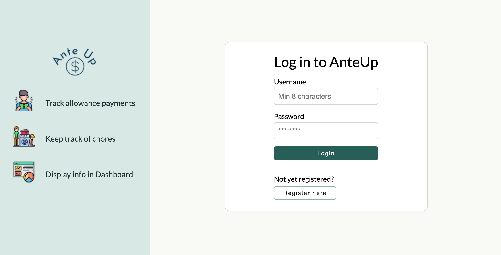
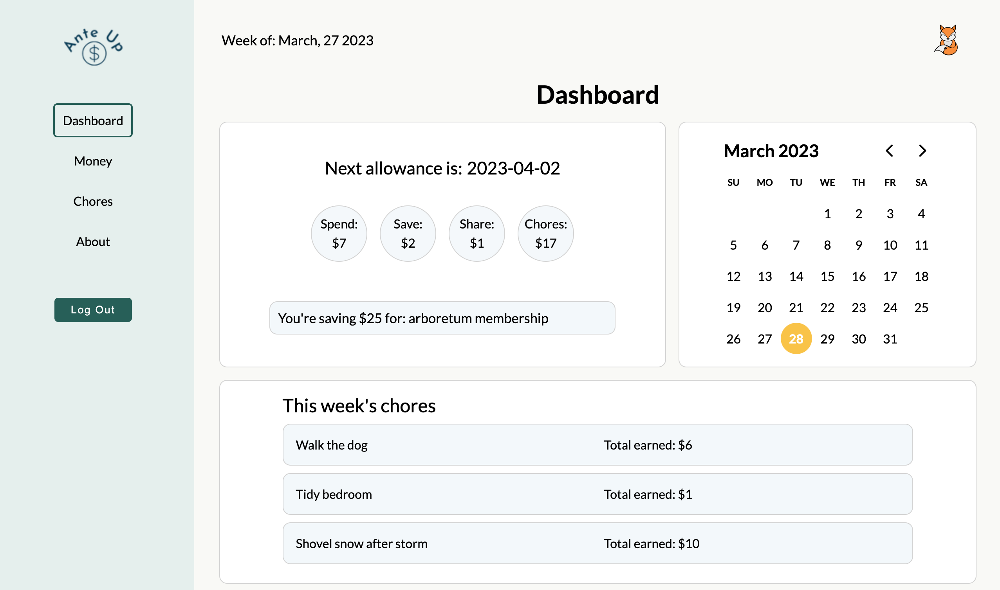
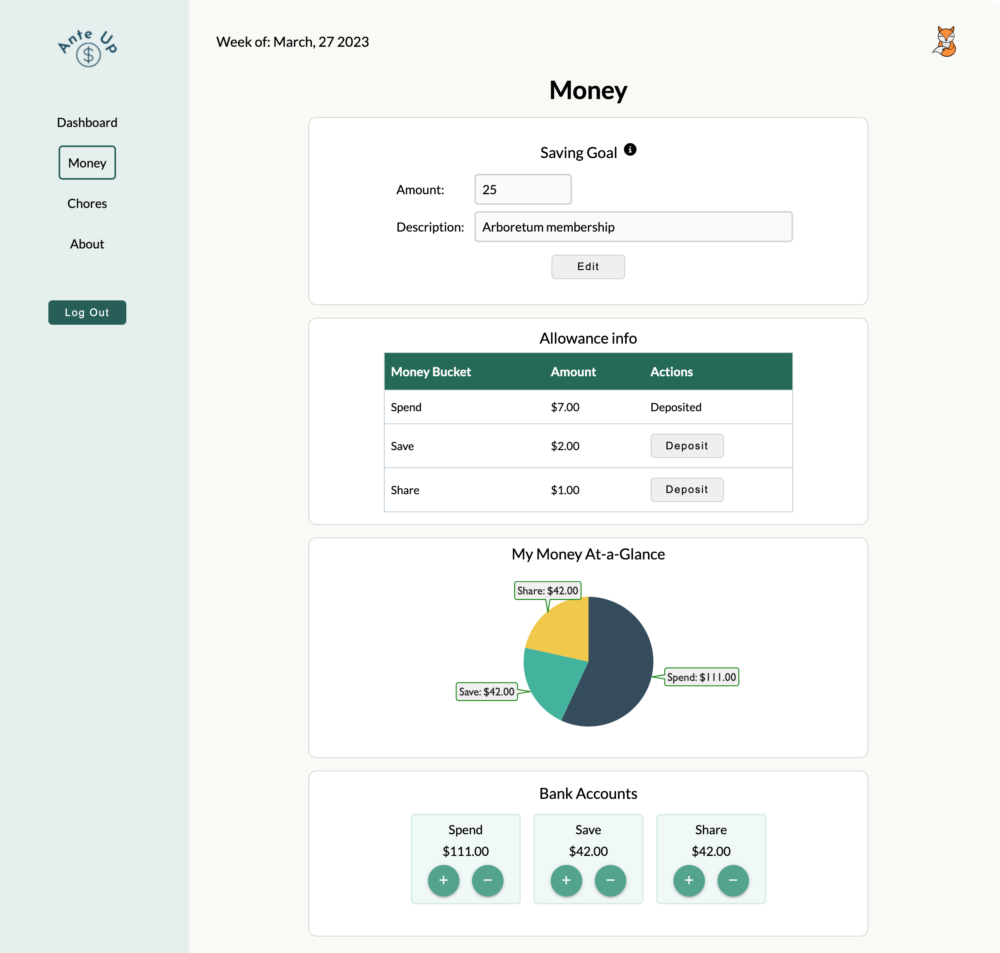
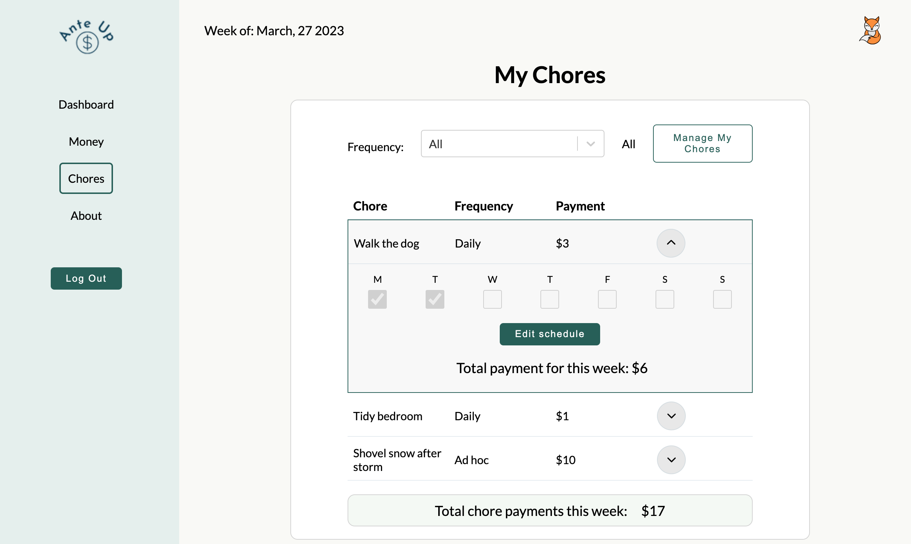
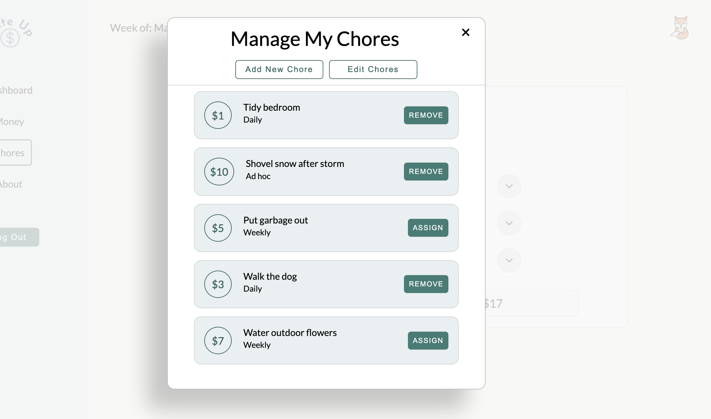
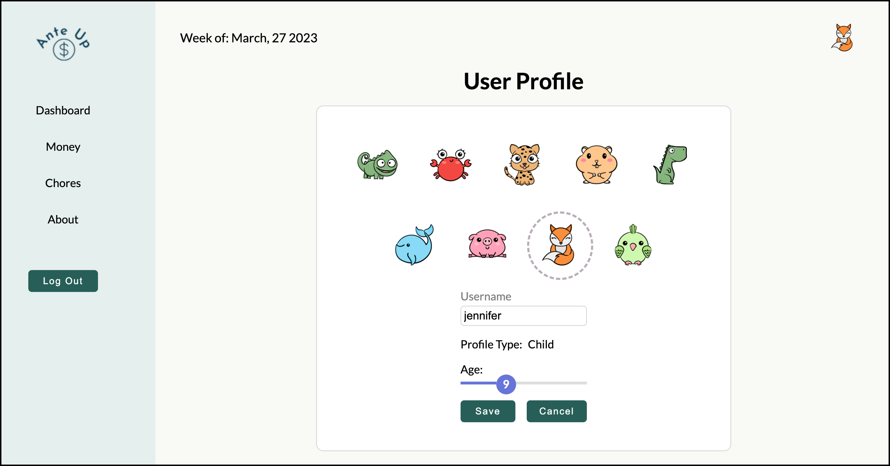

# 

## Run the app here: <https://protected-ocean-74312-c02a72bd4c13.herokuapp.com/>

## Description

* Ante Up is a **responsive** full stack web application that gives kids the ability to track their allowances and chores.
* There were 5 phases of development:

  * Login/Register functionality:
    * User can login or register (if new user).

# 

* Dashboard functionality:
  * User see a snapshot of upcoming allowances and chores that are due.

# 

* Money functionality:
  * User can "deposit" allowance into their 3 buckets: spend, share or save. Values are based as follows:
    * Spend is age * 70%
    * Save is age * 20%
    * Share is age * 10%
  * User will see a breakdown of spend, share and save bucks via VictoryPie component from Victory package.
  * User can move money (withdraw, deposit) between spend, share and save buckets.

# 

* Chore functionality:
  * User can see a list of chores.
  * User can toggle between daily & monthly chores.
  * User can update a chore when done (via checkbox).
  * User can add comments to a chore.

# 

# 

* User profile functionality:
  * User can change username.
  * User can change avatar.
  * User can change age.

# 

## To Run

* Run queries found in database.sql file in a database application (I use Postico). This will create the required database files.
* Clone repository locally.
* Run **_npm install_** to install all dependencies.
* Run **_npm run server_** to start server.
* Run **_npm run client_** to start client.

**Frontend:** Frontend is built using React, Redux, Redux-Saga, JavaScript, CSS and HTML.

**Backend:** Backend is built using Node.js, Express, Axios and PostgreSQL.

**Database:** PostgreSQL.

**Other Tools:** VSCode, Git, GitHub
