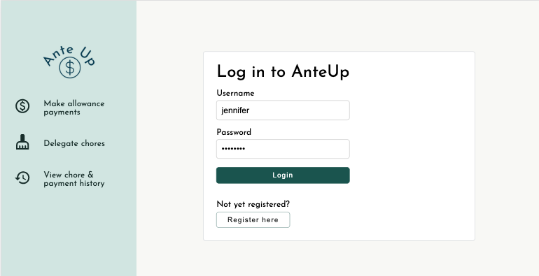
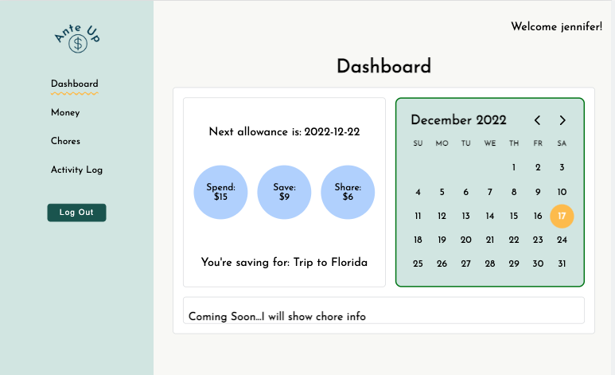
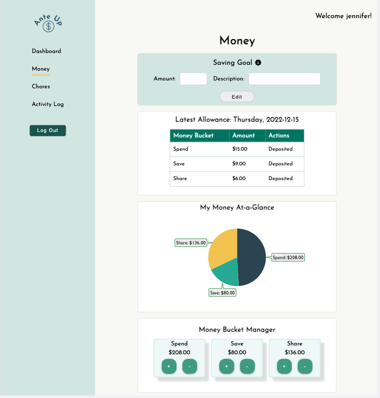

# 

## Description

* Ante Up is a full stack web application that gives kids the ability to track their allowances and chores.
* There will be 4 phases of development:

  * Login/Register functionality (COMPLETED):
    * User can login or register (if new user).

# 

* Dashboard functionality (CURRENTLY IN PROGRESS):
  * User see a snapshot of upcoming allowances and chores that are due.

# 

* Money functionality (CURRENTLY IN PROGRESS):
  * User can "deposit" allowance into their 3 buckets: spend, share or save.
  * User will see a breakdown of spend, share and save bucks via VictoryPie component from Victory package.
  * User can move money (withdraw, deposit) between spend, share and save buckets.

# 

* Chore functionality (NOT YET STARTED):
  * User can see a list of chores.
  * User can toggle between daily & monthly chores.
  * User can propose a new chore to parent.
  * User can update a chore when done (via checkbox).
  * User can add comments to a chore.

**Frontend:** Frontend is built using React, Redux, Redux-Saga, JavaScript, CSS and HTML.

**Backend:** Backend is built using Node.js, Express, Axios and PostgreSQL.

**Database:** I'm using Postico.

**Other Tools:** VSCode, Git, GitHub
